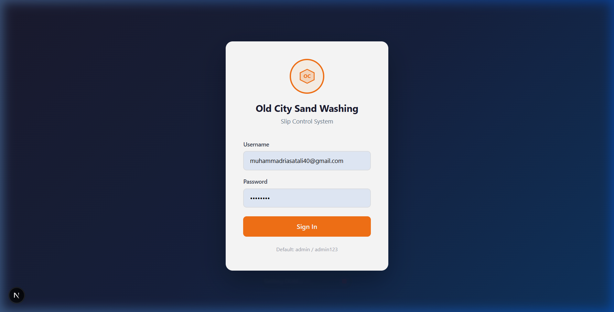
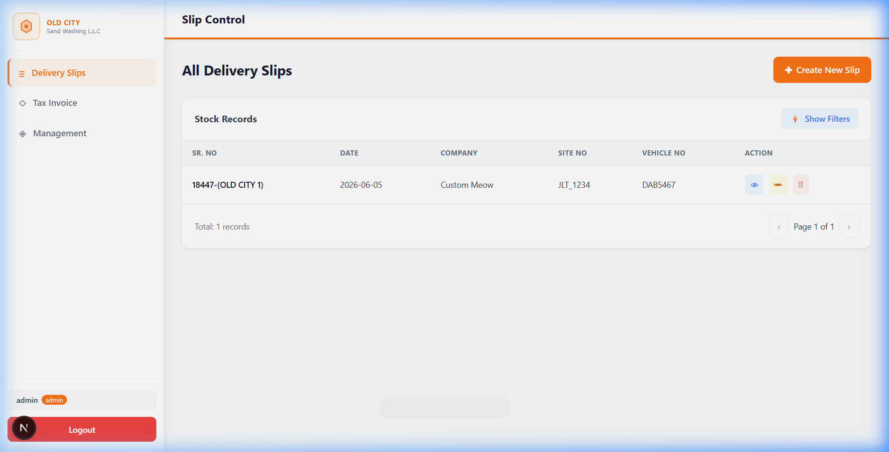
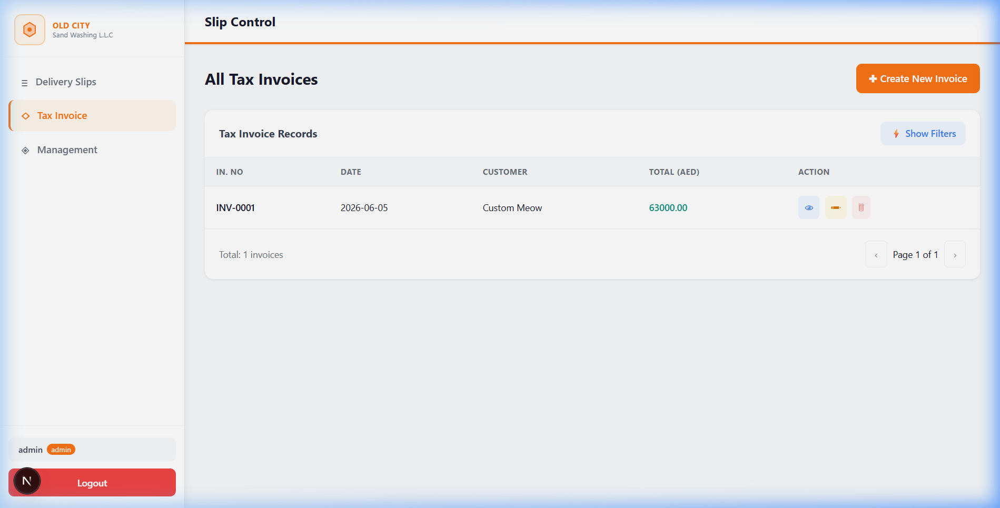
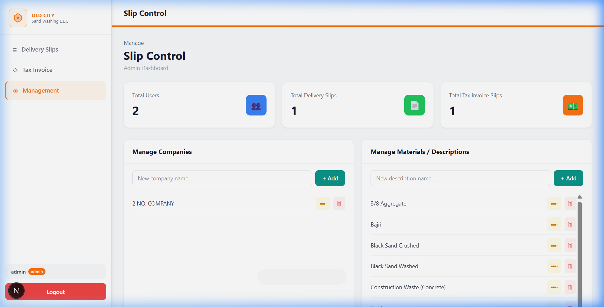

# 📦 Delivery Slip Manager
### Old City Sand Washing — Delivery Management System

A full-stack web application for managing delivery slips, tax invoices, and company operations — built with Next.js, TypeScript, and SQLite.

---

## 📸 Screenshots

### Login Page


### Delivery Slips


### Tax Invoice


### Management Dashboard (Admin)


---

## 🚀 Quick Start

```bash
npm install
npm run dev
```

Then open [http://localhost:3000](http://localhost:3000)

---

## 🔐 Default Credentials

| Role  | Username | Password  |
|-------|----------|-----------|
| Admin | `admin`  | `admin123` |
| User  | `user1`  | `user123`  |

---

## ✨ Features

- **Delivery Slips** — Create, view, edit, delete. Filter by date/company/vehicle. Printable PDF delivery note.
- **Tax Invoices** — Full VAT calculation, auto invoice numbering, PDF download, Excel export by date range.
- **Management** — Admin-only dashboard with stats, manage companies & materials lists.
- **Auth** — JWT cookie-based login with role-based access (admin vs user).

---

## 🗄️ Database

SQLite via sql.js — stored in `/data/delivery.db`. Auto-created on first run with seed data.

---

## 🛠️ Tech Stack

| Technology | Purpose |
|------------|---------|
| Next.js 16 (App Router) | Full-stack framework |
| TypeScript | Type safety |
| Tailwind CSS | Styling |
| sql.js (SQLite) | Database |
| bcryptjs | Password hashing |
| jose | JWT authentication |
| jsPDF + html2canvas | PDF generation |
| xlsx | Excel export |
